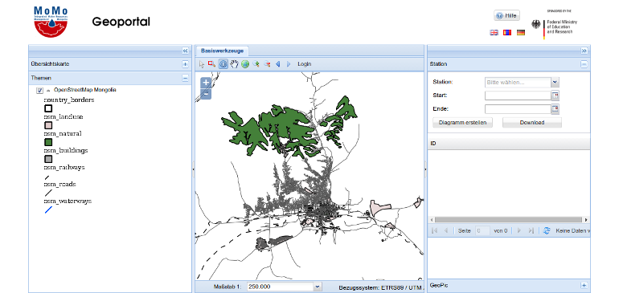

Overview
This workshop is intended to introduce certain key software packages behind the current and upcoming MoMo GeoPortal.

{}

The current version of the soon-to-be-updated MoMo Geoportal{}

In this overview section we'll learn about the following topics

- [Prerequisites]()
- [References]()
- [Setup]()
- [Data]()
